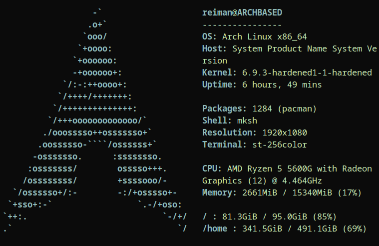

paleofetch-plus
==========

A rewrite of [neofetch](https://github.com/dylanaraps/neofetch) in C.
Currently only supports Linux and Xorg.

Why use paleofetch-plus over plain paleofetch?
-----------------------------------------
simply because I decided to add some sensible features to it, one example being the ability to print the values dependending on the wideness, thus not shifting the logo under the wrongly printed information

Example output:

Dependencies
------------

Paleofetch-plus requires `libX11` and `libpci`. If you're running Xorg you should already have
the former. On Arch Linux, you should have `libpci` already installed if you have `pciutils`
installed. On other linux distrobutions, you may need to install libpci seperatley
if its not already present.

Compiling
---------

    make install

Usage
-----

After compiling, simply run the executable:

    paleofetch-plus

By default, `paleofetch-plus` will cache certain  information (in `$XDG_CACHE_HOME/paleofetch`)
to speed up subsequent calls. To ignore the contents of the cache (and repopulate it), run

    paleofetch-plus --recache

The cache file can safely be removed at any time, paleofetch will repopulate it
if it is absent.

Configuration
-------------

Paleofetch-plus is configured by editing `config.h` and recompiling.
You can change your logo by including the appropriate header file in the logos directory.
The color with which paleo fetch draws the logo can be chosen by defining the `COLOR` macro,
look up ANSI escape codes for information on customizing this.

The last configuration is the `CONFIG` macro, which controls what information paleofetch-plus
prints. Each entry in this macro should look like

    { "NAME: ",   getter_function, false }, \
    
Take note of the trailing comma and backslash. The first piece, `"NAME: "`, sets
what paleofetch-plus prints before printing the information; this usually tells you what
bit of information is being shown. Note that the name entry should be unique for entries
which are to be cached. The second piece, `getter_function`, sets
which function paleofetch-plus will call display. Current available getter functions are

* `get_title`: prints `host@user` like in a bash prompt. Host and user will be printed in color.
* `get_bar`: Meant to be added after `get_title`, underlines the title
* `get_os`: Prints your operating system (including distrobution)
* `get_host`: Prints the model of computer
* `get_kernel`: Prints the version of the linux kernel
* `get_uptime`: Shows how long linux has been running
* `get_packages`: Shows how many packages you have installed. Currently only works for pacman.
* `get_shell`: Shows which shell you are using
* `get_resolution`: Prints your screen resolution
* `get_terminal`: Prints the name of your current terminal
* `get_cpu`: Prints the name of your CPU, number of cores, and maximum frequency
* `get_gpu1`, `get_gpu2`: Print the GPU on your system. If you don't have both integrated graphics and an external GPU, `get_gpu2` will likely be blank
* `get_gpu`: (Tries to) print your current GPU

To include a blank line between entries, put `SPACER \` between the two lines
you want to separate.

The booleans in `CONFIG` tell paleofetch-plus whether you want to cache an entry.
When cached, paleofetch-plus will save the value and not recompute it whenever you run paleofetch-plus
(unless you specify the `--recache` option).

The CPU and GPU name can be configured as well. This is done under the CPU_CONFIG and GPU_CONFIG section
in the config.h file. Two macros are provided to customize and tidy up the model names:

* `REMOVE(string)`: removes the first occurence of `string`
* `REPLACE(string1, string2)`: replaces the first occurence of `string1` with `string2`

Don't forget to run paleofetch-plus with the --recache flag after compiling it with your new
configuration, otherwise it will still show the old name for already cached entries.

TO DO
-----
*Make the code cleaner.
*Maybe adding options for other distros that are not arch.

FAQ
---

Q: Do you really run neofetch every time you open a terminal?  
A: Yes, I like the way it looks and like that it causes my prompt to start midway
down the screen. I do acknowledge that the information it presents is not actually useful.
